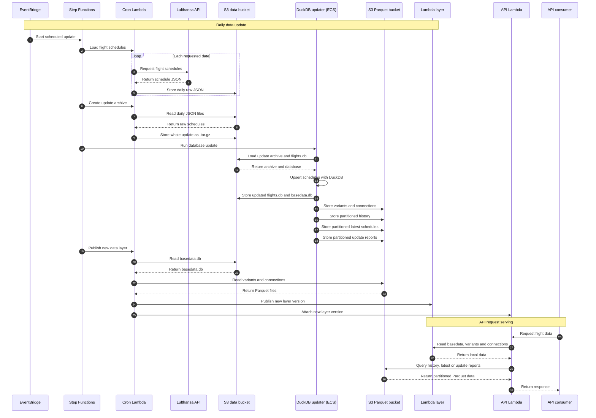

# updater

Python implementation of the DuckDB updater workflow previously implemented in `go/database`.

## Data flow



## Setup

```bash
uv sync
```

## Run

```bash
uv run updater --help
```

The CLI accepts the same updater flags used by the Go application:

- `--time`
- `--database-bucket`
- `--full-database-key`
- `--basedata-database-key`
- `--parquet-bucket`
- `--variants-key`
- `--report-key`
- `--connections-key`
- `--history-prefix`
- `--latest-prefix`
- `--input-bucket`
- `--input-key`
- `--update-summary-bucket`
- `--update-summary-key`
- `--skip-update-database`

Optional:

- `--parquet-uri-schema` (default `s3`, use `file` for local paths)
- `--aws-region` (default `eu-central-1`)
- `--log-level` (default `INFO`)
